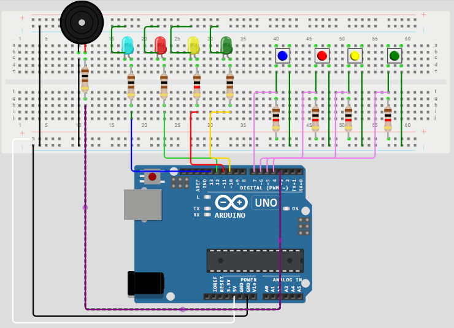

# Simon Memory Game | Arduino Uno

## Overview

This project is a Simon-style memory game prototype built using an Arduino Uno. It demonstrates the integration of hardware and firmware to create an interactive embedded system using push buttons, LEDs, and a buzzer.

## Features

* 4 push-button inputs (Blue, Red, Yellow, Green)
* 4 LEDs for visual feedback
* Buzzer for audio tones
* Active-low input using pull-up resistors
* Serial debugging (115200 baud)

## How It Works

Each button uses a pull-up resistor configuration, meaning the default state is HIGH and a button press registers as LOW.

When a button is pressed:

* The corresponding LED turns ON
* A unique tone is played through the buzzer at its frequency rate
* A message is printed to the Serial Monitor

 ## Tools & Environment
- Wokwi Simulator (Arduino development, circuit design, and firmware testing)
- Arduino (C/C++ embedded programming)
- Serial Monitor (debugging at 115200 baud)

## Hardware Components

* Arduino Uno 
* Breadboard
* 4 Push Buttons
* 4 LEDs
* Resistors (LED + pull-up)
* Buzzer
* Jumper wires

* ## Design Considerations
Button debouncing was considered during development to improve input reliability. Hardware-based debouncing using capacitors was initially planned; however, due to limitations within the Wokwi simulation environment, this was not implemented. Future iterations may include hardware or software debouncing techniques to enhance system stability.

## Skills Demonstrated

* Basic Embedded Systems Programming (C/C++)
* GPIO Input/Output Control
* Active-low logic (pull-up resistors)
* Hardware-software integration
* Serial debugging

## Acknowledgment

This project was developed as part of an embedded systems course. The implementation is based on course concepts, with independent hardware setup, testing, and debugging.

## Circuit Diagram

